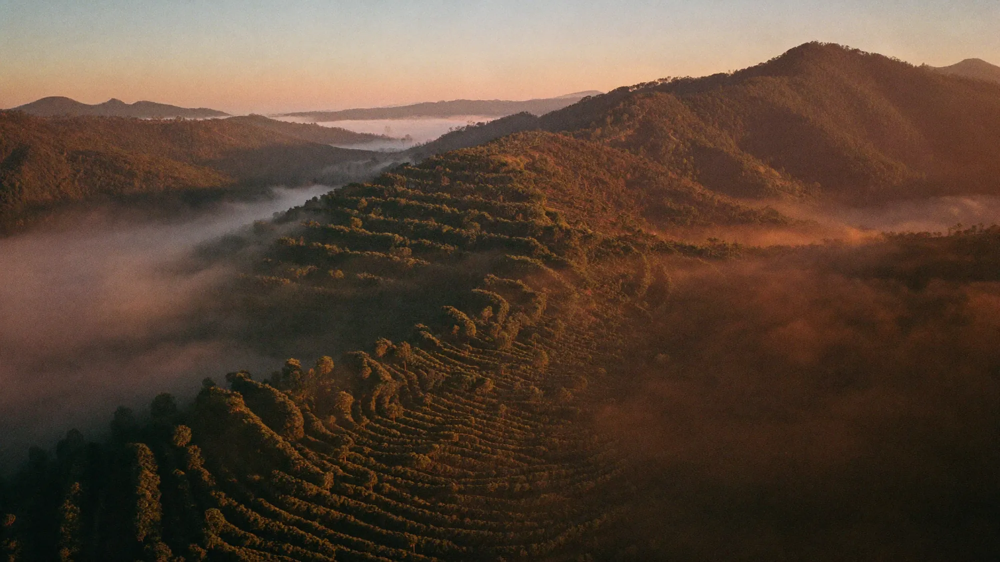

# TERRAL — da montanha à xícara

Experiência web sobre o universo do café, criada como projeto conceitual de portfólio da [MilWeb](https://milweb.com.br). A marca e os dados comerciais são ilustrativos.

[Ver demonstração](https://terral-delta.vercel.app/) · [Portfólio MilWeb](https://milweb.com.br)



## A experiência

Uma página contínua apresenta cinco capítulos — **Caparaó, Terreiro, Tambor, Moenda e Xícara** — com navegação, manifesto, catálogo de cafés e rodapé.

O foco técnico está na combinação de conteúdo editorial, mídia e animação ligada à rolagem. Os capítulos usam painéis horizontais, vídeos com imagens de abertura e uma identidade de cor própria para cada etapa.

## Stack

- Next.js 16.2.11, React 19 e TypeScript.
- Tailwind CSS 4.
- GSAP, ScrollTrigger e Lenis.
- Three.js, React Three Fiber e drei.

As versões completas e os scripts estão em [package.json](package.json).

## Rodar localmente

```bash
git clone https://github.com/rickjs2005/terral.git
cd terral
npm ci
npm run dev
```

Abra http://localhost:3000.

| Comando | Uso |
|---|---|
| `npm run dev` | Desenvolvimento |
| `npm run build` | Build de produção |
| `npm run start` | Servir o build |
| `npm run lint` | Análise estática com ESLint |

## Estrutura

- `src/app/page.tsx`: composição da página.
- `src/components/`: navegação, hero, capítulos, cafés e rodapé.
- `src/lib/chapters.ts`: textos, cores, indicadores e caminhos de mídia dos cinco capítulos.
- `public/shot/`: imagens e vídeos usados na experiência.

## Escopo

Este repositório demonstra uma experiência de marca; não representa uma operação real de torrefação ou uma entrega contratada. Os números e produtos apresentados fazem parte do conceito.

Os vídeos em `public/shot/` são referenciados pelos capítulos e fazem parte da aplicação. Logs locais e arquivos temporários de auditoria não devem ser versionados.
